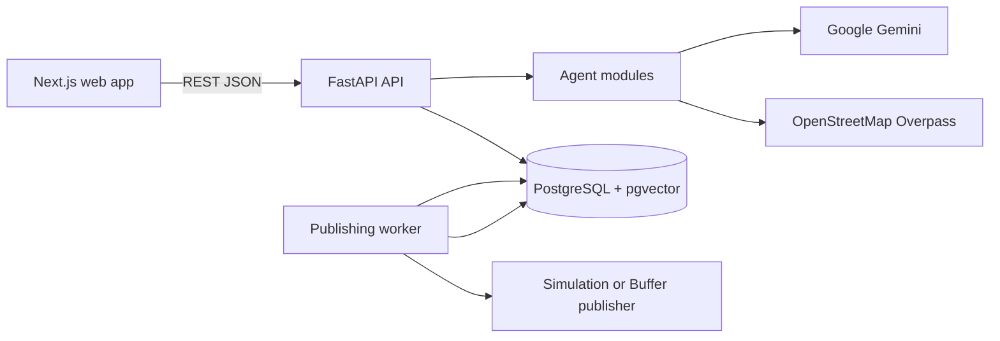
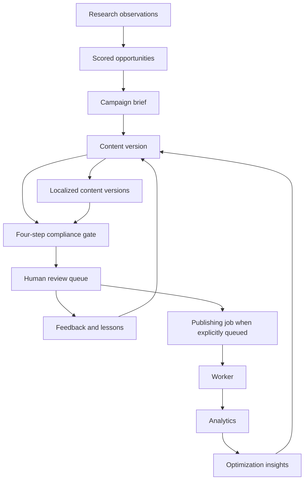

# Architecture

## System purpose

JAPAI coordinates research, opportunity discovery, campaign creation, content generation, localization, compliance review, human decisions, and publishing for three insurance brands: Jade, Jaguar Transit, and DoctorShield.

## Runtime topology

Docker Compose runs four services:

| Service | Responsibility | Runtime |
| --- | --- | --- |
| `postgres` | Relational storage and pgvector-capable database | `pgvector/pgvector:pg16` |
| `api` | HTTP API, agent orchestration, migrations/seeding access | Python 3.11, FastAPI, Uvicorn |
| `web` | Browser UI | Next.js 14, React 18, TypeScript |
| `worker` | Publishing queue polling and analytics synchronization | Python 3.11, APScheduler or resilient loop |

## Request path

1. The browser calls the API through `apps/web/lib/api.ts`.
2. A FastAPI router validates the request and opens a SQLAlchemy session.
3. The router invokes an agent or deterministic service.
4. Database records are created or updated. LLM calls are logged in `ai_runs`.
5. The API returns JSON consumed by the corresponding web screen.
6. Publishing jobs are processed separately by the worker. The worker never shares the API process.

## Core boundaries

### Web application

The web app owns navigation, forms, loading states, error display, review actions, and visualization. It does not own compliance logic or database access.

### API and agents

Routers are the HTTP boundary. Agent modules under `apps/api/agents/` own domain behavior such as content generation, compliance, localization, lessons, research, lead scoring, and optimization.

### Database

SQLAlchemy models define persistent entities. Alembic migrations define schema evolution. The API startup also verifies tables and seeds initial brands when the database has no brands.

### Worker

The worker claims only due `pending` publishing jobs using row locks with `SKIP LOCKED`. It transitions jobs through publishing, published, scheduled, or failed states and can sync metrics back into `analytics`.

## Main domain flow

## Design principles

- Deterministic checks run before model-based checks where possible.
- Compliance failures default to review or rejection; malformed model output must not silently pass.
- Brand-specific knowledge and rules are scoped by brand.
- Generated versions retain metadata and prompt provenance for inspection.
- Simulated data is marked and must not be interpreted as production evidence.
- External publishing is opt-in through provider configuration.
