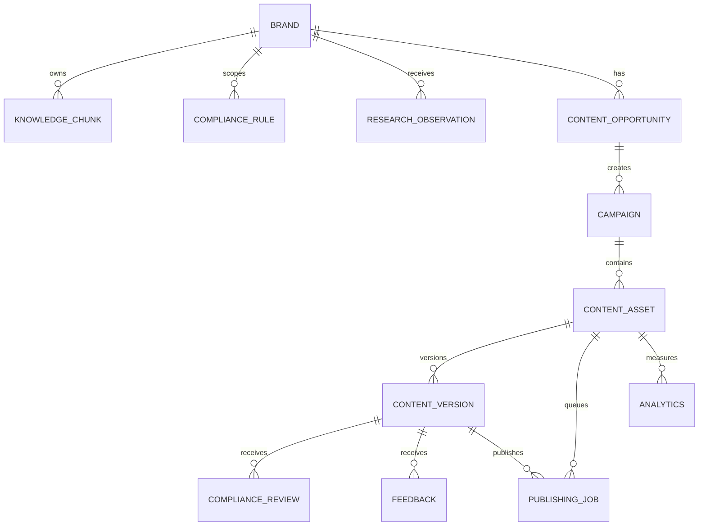

# Data Model

The persistence layer uses SQLAlchemy models in `apps/api/models/` and Alembic migrations in `db/migrations/versions/`. All primary entities use UUID IDs and timestamp fields from the shared base mixins.

## Entity groups

### Organization and product context

- `organizations`: organization boundary placeholder.
- `brands`: Jade, Jaguar Transit, and DoctorShield brand configuration.
- `products`: product context associated with brand data.
- `compliance_rules`: global and brand-scoped compliance rules.
- `knowledge_chunks`: approved claims, restricted claims, research notes, and other brand knowledge.

### Content lifecycle

- `content_opportunities`: scored market/content opportunities.
- `campaigns`: campaign briefs created from opportunities or events.
- `content_assets`: logical content items and their campaign/platform context.
- `content_versions`: immutable-ish generated or edited versions with body, status, metadata, and prompt provenance.
- `compliance_reviews`: deterministic, AI, and human review records attached to versions.
- `feedback`: reviewer decisions, notes, and reason tags.
- `lessons`: aggregated feedback injected into future content prompts.

### Research, leads, and analytics

- `research_observations`: external research notes and source URLs.
- `leads`: scored prospects and outreach context.
- `lead_signals`: evidence supporting lead fit.
- `lead_activities`: lead workflow activity history.
- `analytics`: metric rows for content assets and platforms; simulated rows are marked.
- `performance_insights`: optimization findings based on aggregate analytics.

### AI and publishing

- `ai_runs`: model call audit records including agent, model, timing, prompt version, status, and errors.
- `publishing_jobs`: queue records linking a content asset/version to a platform and provider status.

## Key relationships

## Content status values

`content_versions.status` supports `draft`, `submitted_for_review`, `approved`, and `rejected`.

## Compliance outcome values

`compliance_reviews.outcome` supports `pass`, `fail`, `warning`, and `needs_human_review`. Reviewer type is one of `ai_agent`, `human`, `deterministic`, or `llm`.

## Publishing status values

`publishing_jobs.status` supports `pending`, `scheduled`, `publishing`, `published`, `failed`, and `cancelled`.

## Schema evolution

The migration history currently contains the initial schema and incremental changes for compliance, feedback linkage, content asset origin, lessons, research/opportunities/campaigns, leads, analytics/optimization, and localization. Run `alembic upgrade head` before using a fresh database.

## Data safety notes

- Demo snapshot loading replaces table contents and should be treated as destructive.
- `embedding` is present for knowledge retrieval work but the current demo uses category/keyword retrieval.
- Analytics may be simulated; consumers must inspect `is_simulated`.
- Generated prompt metadata is intentionally stored to support provenance and debugging.
